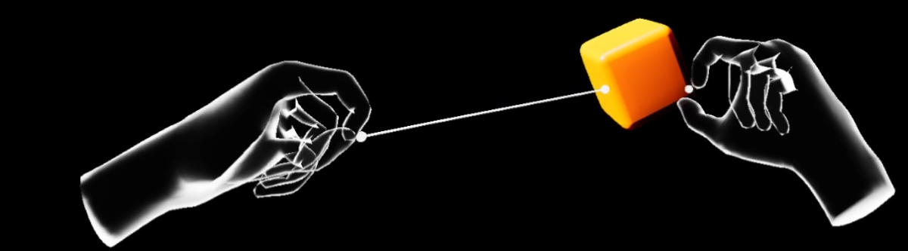
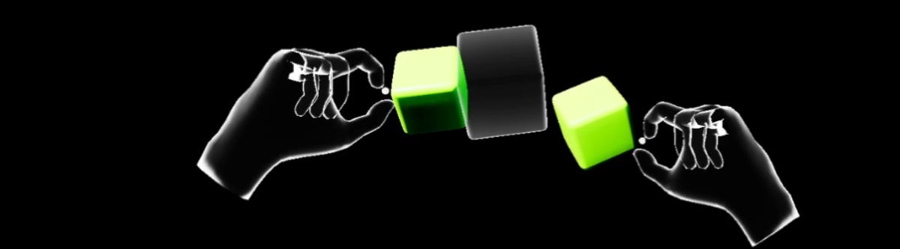
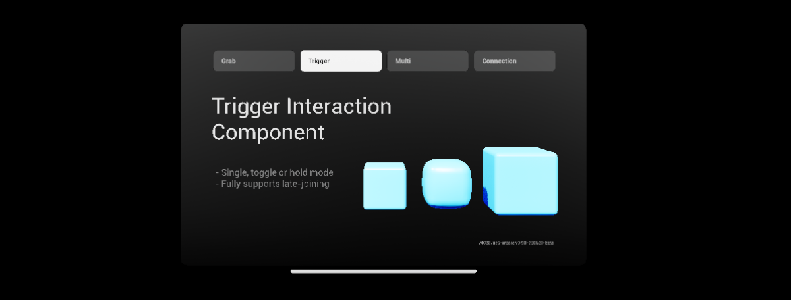

<div align="center">

# UE5 XRCore V1.0.0

**OpenXR-based multiplayer interaction framework and utilities**  for **Unreal Engine 5.6.1+**


</div>

---

## Setup

You can either use the **precompiled binaries** or **build from source**.

<details open>
<summary><h3>Option A — Precompiled Binaries (Recommended)</h3></summary>

1. Download the latest release from the **Releases** section.
2. Extract the plugin into your project:
   ```
   [YourProject]/Plugins/XRCore
   ```
3. Open the project in Unreal Engine 5.5 and enable **XRCore** if needed.
4. Restart the editor.

</details>

<details>
<summary><h3>Option B — Build from Source</h3></summary>

1. Clone this repository into your project's `Plugins` folder:
   ```
   [YourProject]/Plugins/XRCore
   ```
2. Open the project in **Unreal Engine 5.6.1 (or higher)**.
3. Let Unreal build the plugin when prompted.
4. Restart the editor once compilation finishes.

</details>

> [!IMPORTANT]
> XRCore is OpenXR-based. Make sure **OpenXR** is enabled in your project.

---

## Documentation

### Player

The player system is built around a modular XR pawn and flexible hand components.  
Designed for both tracked hands and motion controllers, with multiplayer and input support baked in.

<table>
<tr>
<td width="50%">

#### XRCore Hand (Actor + Component)

Spawns a replicated hand actor attached to a controller or tracked hand.  
Interaction and input are handled via modular components like **XRInteractor** and **XRLaser**.  
Remote hands use smooth transform interpolation, with configurable replication behavior.

</td>
<td width="50%">

#### XRCore Pawn

A lightweight example pawn showing how to integrate XRHands.  
Initializes input and forwards commands to the hands via an interface.

</td>
</tr>
</table>

---

### Interaction System

<div align="center">



</div>

A modular, multiplayer-ready interaction system with dedicated components for grabbing, triggering, hovering, and more. Fully replicated and safe for late-joining clients.

> **Replication:** interaction events, physics state, and hover highlights are replicated and latency-tolerant.

<table>
<tr>
<td>

#### XRInteractorComponent

Attach this to your pawn or controller.  
Finds nearby interactables, resolves priorities, and executes interaction logic server-side.

</td>
<td>

#### XRInteractionComponent

Add this to any actor to make it interactive.  
Handles interaction state, hover, priority, and networking.

</td>
</tr>
</table>

| Interaction Type | Description |
|------------------|-------------|
| **Grab** | Physics or attachment-based grabbing (physics supports two-hand and shared multiplayer interaction). |
| **Trigger** | Buttons, toggles, and switches (toggle / hold / one-shot). |
| **Custom interactions** | Subclass `UXRInteractionComponent` and override `OnInteractionStart`, `OnInteractionEnd`, and optionally `OnInteractionHover`. |

<br>

**Setup:**  
Add an `XRInteractionComponent` (or subclass) to your actor and set `IsReplicated = true` for multiplayer.

> [!TIP]
> See `/Demo/Blueprints` for examples.

---

### Connection System

<div align="center">



</div>

A fully replicated system for dynamically connecting and attaching actors at runtime.

| Component | Description |
|-----------|-------------|
| **XRConnectorComponent** | Manages networked connections |
| **XRConnectorSocket** | Defines connection points, compatibility checks, and state |
| **Holograms** | Optional placement previews when overlapping or grabbing |

---

### Utilities

<table>
<tr>
<td width="50%">

#### XRCoreUtilityFunctions

Common helpers such as interaction checks, priority resolution, and controller hand mapping.

</td>
<td width="50%">

#### Spatial Annotation

Simple world-space UI that follows the player's view.  
Useful for labels, hints, and tooltips.

</td>
</tr>
</table>

---

## Demo

### Interaction Demo

<div align="center">



</div>

Single-player scene showcasing grabs, triggers, connections, and composite interactions.  
Map: **`M_Demo_Interactions`**, including spatial annotations and Sequencer integration.

A prebuilt Quest `.apk` is available on the Meta Quest Store as  
**"XRCore Interaction Demo"**.

---

### Multiplayer Demo

Shared physics and interactions in a networked setup.  
Use this to test client/listen-server behavior, late joining, and replication.


---

## API Reference

> [!NOTE]
> All methods and properties listed below are exposed to **Blueprints** via `UFUNCTION(BlueprintCallable)` and `UPROPERTY(BlueprintReadWrite)`.

<details>
<summary><h3>Interfaces</h3></summary>

#### IXRCoreHandInterface

Interface for hand actors. Provides access to interactors, input, and replication.

```cpp
// Get components
UXRInteractorComponent* GetXRInteractor();
UXRLaserComponent* GetXRLaser();

// Hand configuration
void SetControllerHand(EControllerHand InControllerHand);
EControllerHand GetControllerHand();

// Input forwarding
void PrimaryInputAction(float InAxisValue);
void SecondaryInputAction(float InAxisValue);

// Hand tracking
void SetIsHandtrackingActive(bool InIsActive);
bool IsHandtrackingActive();

// Ownership
APawn* GetOwningPawn();

// Replication
void Client_UpdateXRCoreHandReplicationData(const FXRCoreHandReplicationData& InData);
```

#### IXRInteractionInterface

Interface for starting/stopping interactions by priority.

```cpp
void StartInteraction(UXRInteractorComponent* InInteractor, UXRInteractionComponent* InInteraction);
void StartInteractionByPriority(int32 InPriority, EXRInteractionPrioritySelection InCondition);

void StopInteraction(UXRInteractorComponent* InInteractor, UXRInteractionComponent* InInteraction);
void StopInteractionByPriority(int32 InPriority, EXRInteractionPrioritySelection InCondition);
void StopAllInteractions(UXRInteractorComponent* InInteractor);

void HoverInteraction(UXRInteractorComponent* InInteractor, UXRInteractionComponent* InInteraction, bool InHoverState);
```

#### IXRLaserInterface

Interface for laser pointer functionality.

```cpp
void SetLaserActive(bool bInState);
bool IsLaserActive();
EXRLaserState GetLaserState();  // Inactive, Active, Hover, Interact

UXRInteractorComponent* GetXRInteractor();
void SetControllerHand(EControllerHand InXRControllerHand);
void ProvideAttachmentRoot(USceneComponent* InComponent);
AActor* GetXRLaserActor();
```

#### IXRHologramInterface

Interface for connector hologram previews.

```cpp
void InitHologram(const UXRConnectorComponent* InConnector, UStaticMesh* InMesh, float InScale);
void SetHologramState(EXRHologramState InState);  // Visible, Highlighted, Hidden
```

</details>

<details>
<summary><h3>Core Classes</h3></summary>

#### AXRCoreHand

Replicated hand actor attached to motion controllers. Implements `IXRCoreHandInterface`.

| Property | Type | Description |
|----------|------|-------------|
| `XRInteractor` | `UXRInteractorComponent*` | Handles nearby interactions |
| `XRLaserComponent` | `UXRLaserComponent*` | Laser pointer for distant interactions |
| `ControllerHand` | `EControllerHand` | Left, Right, or AnyHand |
| `InterpolationSpeed` | `float` | Smoothing for remote hand transforms |

#### UXRInteractorComponent

Sphere component that detects and manages interactions. Extends `USphereComponent`.

| Method | Description |
|--------|-------------|
| `StartXRInteraction()` | Begin interaction with specified component |
| `StartXRInteractionByPriority()` | Begin interaction by priority level |
| `StopXRInteraction()` | End specific interaction |
| `StopAllXRInteractions()` | Terminate all active interactions |
| `CanInteract()` | Check if interaction is available |
| `GetOverlappedXRInteractions()` | Get all interactables in range |
| `SetPhysicsConstraint()` | Assign constraint for physics grabs |

| Delegate | Signature |
|----------|-----------|
| `OnStartedInteracting` | `(UXRInteractorComponent*, UXRInteractionComponent*)` |
| `OnStoppedInteracting` | `(UXRInteractorComponent*, UXRInteractionComponent*)` |
| `OnHoverStateChanged` | `(UXRInteractorComponent*, UXRInteractionComponent*, bool)` |

#### UXRInteractionComponent

Base class for all interactions. Extend this for custom behavior.

| Overridable Event | Description |
|-------------------|-------------|
| `OnInteractionStart(UXRInteractorComponent*)` | Called when interaction begins |
| `OnInteractionEnd(UXRInteractorComponent*)` | Called when interaction ends |
| `OnInteractionHover(bool, UXRInteractorComponent*)` | Called on hover state change |

| Property | Type | Description |
|----------|------|-------------|
| `InteractionPriority` | `EXRInteractionPriority` | Primary, Secondary, or Custom |
| `MultiInteractorBehavior` | `EXRMultiInteractorBehavior` | Allow, Disable, or TakeOver |
| `LaserBehavior` | `EXRLaserBehavior` | Disabled, Suppress, or Snap |
| `bEnableHighlighting` | `bool` | Material-based hover highlighting |

</details>

<details>
<summary><h3>Interaction Subclasses</h3></summary>

#### UXRInteractionGrab

Physics or attachment-based grabbing.

| Property | Type | Description |
|----------|------|-------------|
| `bEnablePhysics` | `bool` | Use physics constraint vs attachment |
| `PhysicsTag` | `FName` | Tag for additional physics components |

| Method | Description |
|--------|-------------|
| `GetPhysicsReplicationComponent()` | Returns `UXRReplicatedPhysicsComponent*` |
| `HasPhysicsEnabled()` | Check if physics grab is active |

#### UXRInteractionTrigger

State-keeping trigger with multiple modes.

| Property | Type | Description |
|----------|------|-------------|
| `TriggerBehavior` | `EXRInteractionTriggerBehavior` | Trigger, Toggle, or Hold |
| `DefaultTriggerState` | `bool` | Initial state |
| `InteractionDuration` | `float` | Auto-reset time (seconds) |

| Method | Description |
|--------|-------------|
| `SetTriggerState(bool, UXRInteractorComponent*)` | Manually set state (replicated) |
| `GetTriggerState()` | Get current state |

| Delegate | Signature |
|----------|-----------|
| `OnTriggerStateChanged` | `(UXRInteractionTrigger*, bool, UXRInteractorComponent*)` |

</details>

<details>
<summary><h3>Connection System Classes</h3></summary>

#### UXRConnectorComponent

Allows actors to connect to sockets. Extends `UActorComponent`.

| Property | Type | Description |
|----------|------|-------------|
| `ConnectorID` | `FName` | ID for socket compatibility |
| `MinDistanceToConnect` | `float` | Snap distance threshold |
| `bAutoBindToGrabInteraction` | `bool` | Auto-connect on grab release |
| `HologramClass` | `TSubclassOf<AActor>` | Hologram actor class |
| `HologramMesh` | `UStaticMesh*` | Mesh for preview |

| Method | Description |
|--------|-------------|
| `Server_ConnectToSocket()` | Connect to specific socket (replicated) |
| `Server_ConnectToClosestOverlappedSocket()` | Auto-connect to nearest (replicated) |
| `Server_DisconnectFromSocket()` | Disconnect (replicated) |
| `ShowAllAvailableHolograms()` | Display hologram previews |

| Delegate | Signature |
|----------|-----------|
| `OnConnected` | `(UXRConnectorComponent*, UXRConnectorSocket*)` |
| `OnDisconnected` | `(UXRConnectorComponent*, UXRConnectorSocket*)` |

#### UXRConnectorSocket

Connection point that accepts compatible connectors. Extends `USphereComponent`.

| Property | Type | Description |
|----------|------|-------------|
| `ID` | `FName` | Socket identifier |
| `DefaultSocketState` | `EXRConnectorSocketState` | Available, Occupied, Disabled |
| `CompatibleConnectorIDs` | `TArray<FName>` | Allowed connector IDs (empty = any) |

| Method | Description |
|--------|-------------|
| `SetSocketState()` | Change availability |
| `IsConnectionAllowed()` | Check compatibility |
| `GetAttachedXRConnectors()` | Get connected components |

| Delegate | Signature |
|----------|-----------|
| `OnConnectedTo` | `(UXRConnectorSocket*, UXRConnectorComponent*)` |
| `OnDisconnectedFrom` | `(UXRConnectorSocket*, UXRConnectorComponent*)` |

</details>

<details>
<summary><h3>Utility Functions</h3></summary>

#### UXRToolsUtilityFunctions

Static Blueprint function library.

```cpp
// XR Standard
static EXRStandard GetXRStandard();

// Actor queries
static bool IsActorInteractive(AActor* InActor, TArray<UXRInteractionComponent*>& OutInteractions);
static bool IsActorInteractedWith(AActor* InActor, TArray<UXRInteractionComponent*>& OutActive);

// Priority resolution
static UXRInteractionComponent* GetXRInteractionByPriority(
    const TArray<UXRInteractionComponent*>& InInteractions,
    UXRInteractorComponent* InXRInteractor,
    int32 InPriority,
    EXRInteractionPrioritySelection InCondition,
    int32 MaxSecondaryPriority = 5
);

static UXRInteractionComponent* GetXRInteractionOnActorByPriority(
    AActor* InActor,
    UXRInteractorComponent* InXRInteractor,
    int32 InPriority,
    EXRInteractionPrioritySelection InCondition
);

// Connection helpers
static void TryConnectToActor(UXRConnectorComponent* InConnector, AActor* InActor, const FString& InSocketID);

// Enum helpers
static ESimplifiedControllerHand SimplyfyControllerHandEnum(EControllerHand InControllerHand);
```

</details>

<details>
<summary><h3>Enums</h3></summary>

| Enum | Values | Description |
|------|--------|-------------|
| `EXRStandard` | `OpenXR`, `MetaXR` | XR runtime backend |
| `ESimplifiedControllerHand` | `Left`, `Right`, `Any` | Reduced hand enum |
| `EXRLaserState` | `Inactive`, `Active`, `Hover`, `Interact` | Laser pointer state |
| `EXRInteractionPriority` | `Primary`, `Secondary`, `Custom` | Interaction priority level |
| `EXRInteractionPrioritySelection` | `Equal`, `HigherEqual`, `LowerEqual` | Priority matching mode |
| `EXRLaserBehavior` | `Disabled`, `Suppress`, `Snap` | Laser behavior during interaction |
| `EXRMultiInteractorBehavior` | `Enabled`, `Disabled`, `TakeOver` | Multi-interactor handling |
| `EXRInteractionTriggerBehavior` | `Trigger`, `Toggle`, `Hold` | Trigger interaction mode |
| `EXRConnectorSocketState` | `Available`, `Occupied`, `Disabled` | Socket availability |
| `EXRHologramState` | `Visible`, `Highlighted`, `Hidden` | Hologram display state |

</details>
