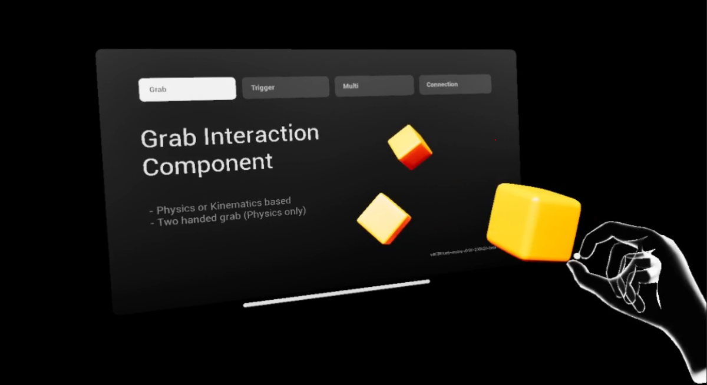

# XRCore 0.9.0 beta
XR in Unreal Engine 5.5 - OpenXR based Multiplayer Interaction and Utilities.
 
[Demo Video](https://vimeo.com/1002763137)

## Player System
XRCore’s player system is built around a modular XR pawn and flexible hand components. Designed for both tracked hands and motion controllers using OpenXR, with multiplayer and input support baked in.

#### XRCore Hand Actor & Component
The XRCoreHand system spawns and manages a network-replicated hand actor that attaches to a motion controller, enabling interaction and input handling via modular components like XRInteractor and XRLaser. 
It supports both hand tracking and controller input, with smooth transform interpolation for remote clients and customizable replication behavior.

#### XRCore Pawn
A light-weight demonstration of how to use XRHands on your own Pawn - initializes the Input system and only forwards commands via an Interface to the Hands.

## Interaction System

A modular, multiplayer-ready XR interaction framework for Unreal Engine. Designed for VR/AR, it handles grabbing, triggering, hovering, and more — cleanly synced over the network, including support for late-joining players and high-latency sessions.

**Replication:** all interactions are replicated — including start/stop events, physics state, and hover highlights. The system supports proper late-joining, high latency tolerance and  physics replication.
  
#### XRInteractorComponent
Attach this to your XR Pawn or controller to drive interactions. It finds nearby interactive components, manages priorities, and triggers interaction logic server-side.

#### XRInteractionComponent
Drop this on any object to make it interactive. It handles state, hover, priority, and networking.

- **Grab Interaction** Pick up objects using physics or attachments. Physics grabs allow two-hand holding and are ideal for shared multiplayer manipulation.
- **Trigger Interaction** Use this for buttons, toggles, switches, etc. Supports toggle/hold/one-shot behavior, all replicated.
- **Creating custom Interactions** Extend UXRInteractionComponent, override OnInteractionStart, OnInteractionEnd, and optionally OnInteractionHover. You can hook into all XRInteractor events and fully customize behavior.

#### Setting Up an Interactive Actor
Add an XRInteractionComponent subclass to your actor
For multiplayer, ensure that IsReplicated is set to true.

-> Check out /Demo/Blueprints for ready-to-use examples.

## Connection System

A modular and fully replicated system for dynamically connecting and attaching actors at runtime.

- **XRConnectorComponent** A component that allows objects to establish and manage networked connections.
- **XRConnectorSocket** Defines where things can connect. Each socket supports compatibility checks, states, and connection logic.
- **Holograms** Preview placement with dynamic holograms — shown when overlapping or grabbing, fully customizable and optional.

## Utilities
A collection of adjacent helper functions and tools to streamline development.

#### XRCoreUtilityFunctions
Collection of common XRCore helpers – like checking if an actor is interactive, resolving interaction priorities, and mapping controller hands.

#### Spatial Annotation
[Screenshot: Annotation]

A simple world-space UI that follows the player’s view – perfect for labels, hints, or tooltips. Fully customizable.

## Demo
### Interaction Demo

Single player scene that shows all aspects of the interaction system. Grab, Trigger, Connections and composite interactions (iE. Actors that have multiple interaction components and types). 

The map **M_Demo_Interactions** provides a good showcase of utilities like spatial annotations and how to interface XRCore with sequencers.

-> Provided as a built .apk for Quest Headsets and is available on the Meta Quest store as "XRCore Interaction Demo".

### Multiplayer Demo
[Screenshot: MP Demo, 2 players]

Shared physics, interactions. Use this to try multiplayer with NetMode client or listen-server. Physics, late-joining, Interactions.
